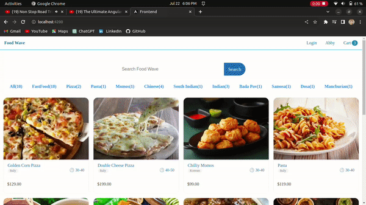
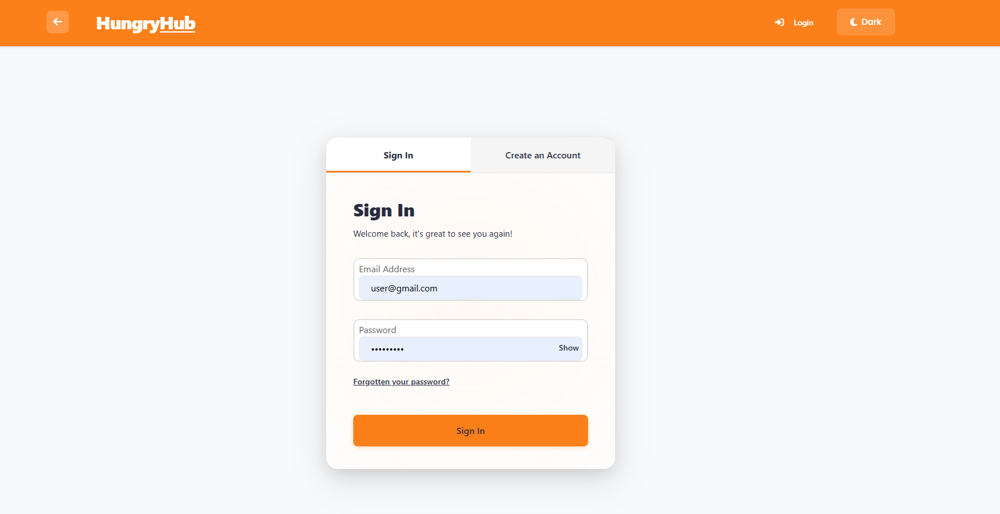
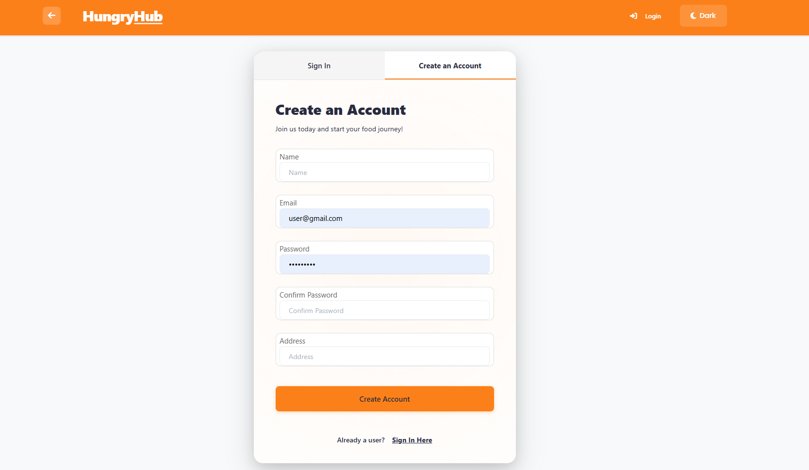
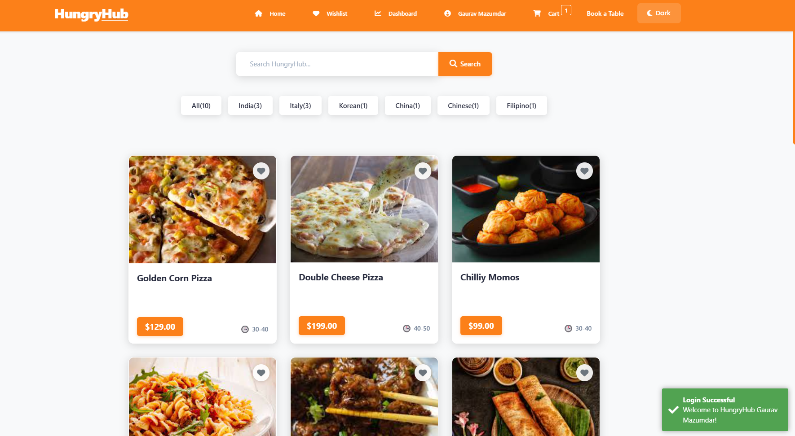
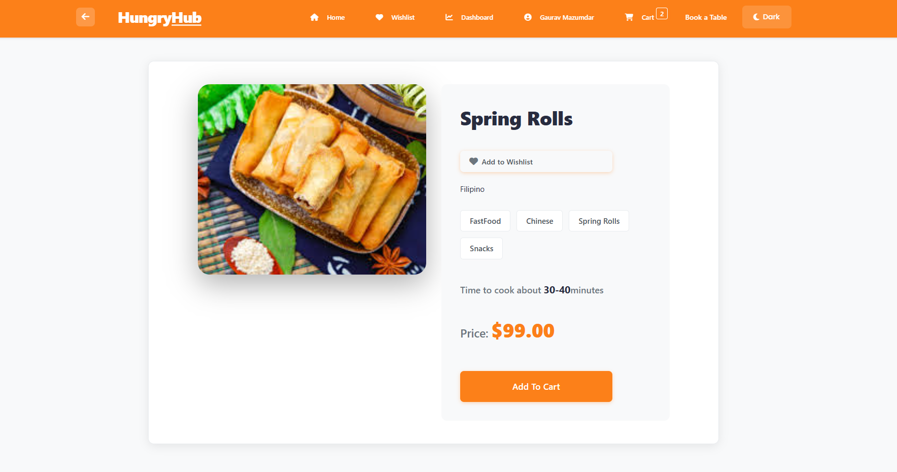
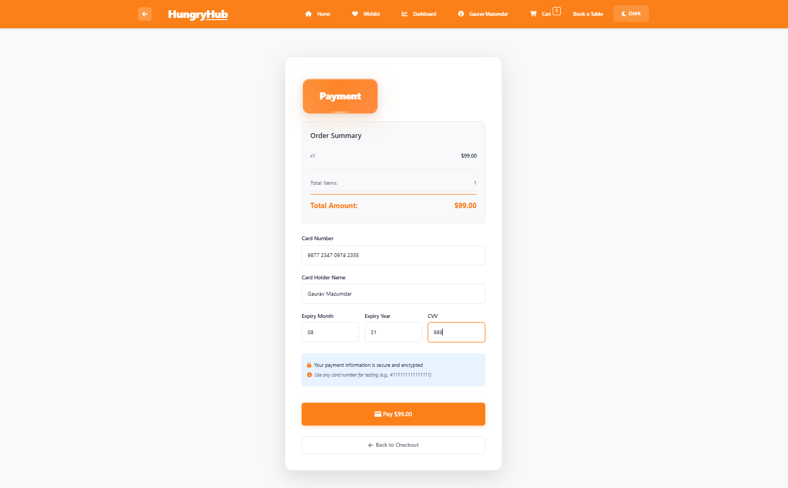
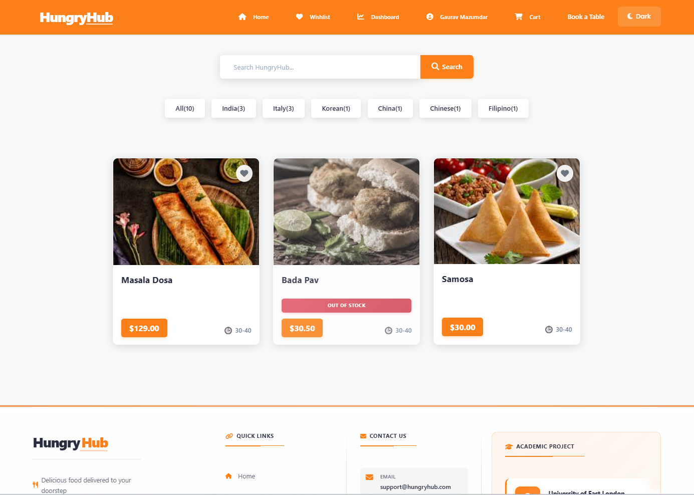

# HungryHub - Food Ordering Website

A full-stack food ordering application built with Angular (frontend), Node.js/Express (backend), and MongoDB (database). Users can browse food items, add them to cart, place orders, make payments, and book tables at restaurants.



## 📸 Screenshots

### Authentication Pages
<div align="center">
  
  <p><em>Sign In Page - User Login Interface</em></p>
  
  
  <p><em>Create Account Page - User Registration</em></p>
</div>

### Homepage & Food Browsing
<div align="center">
  
  <p><em>Homepage - Browse Food Items with Categories and Search</em></p>
  
  
  <p><em>Food Listing Page - Category Filtering and Food Items Display</em></p>
</div>

### Product Details & Shopping
<div align="center">
  
  <p><em>Product Detail Page - Spring Rolls with Add to Cart and Wishlist</em></p>
</div>

### Checkout & Payment
<div align="center">
  
  <p><em>Payment Page - Secure Payment Processing with Order Summary</em></p>
</div>

## 🚀 Features

### Customer Features
- 🔐 User authentication (Login/Register)
- 🏠 Browse food items by categories and tags
- 🔍 Search food items
- 🛒 Shopping cart with quantity management
- ❤️ Wishlist functionality
- 📦 Order placement and tracking
- 💳 Payment processing (with Razorpay integration)
- 📅 Table booking system
- 📱 Responsive design with dark mode support

### Admin Features
- 📊 Dashboard with analytics
- 📈 Order management and tracking
- 🍕 Food inventory management (price and stock)
- 👥 User management
- 📉 Low stock alerts

## 🛠️ Technologies Used

### Frontend
- Angular 16
- TypeScript
- RxJS
- ngx-toastr (Notifications)
- Font Awesome (Icons)

### Backend
- Node.js
- Express.js
- TypeScript
- MongoDB (Mongoose)
- JWT (Authentication)
- bcryptjs (Password hashing)
- Razorpay (Payment gateway)

## 📋 Prerequisites

Before you begin, ensure you have the following installed:

- **Node.js** (v16 or higher) - [Download](https://nodejs.org/)
- **npm** (comes with Node.js) or **yarn**
- **MongoDB** - [Download](https://www.mongodb.com/try/download/community) or use [MongoDB Atlas](https://www.mongodb.com/cloud/atlas) (cloud)
- **Angular CLI** (v16 or higher) - Install globally: `npm install -g @angular/cli`

### Verify Installation

```bash
node --version
npm --version
ng version
mongod --version  # (if using local MongoDB)
```

## 🏗️ Project Structure

```
HungryHub/
├── backend/              # Node.js/Express backend
│   ├── src/
│   │   ├── configs/      # Configuration files
│   │   ├── constants/    # Constants (HTTP status, order status)
│   │   ├── middlewares/  # Express middlewares
│   │   ├── models/       # MongoDB models
│   │   ├── routers/      # API routes
│   │   └── server.ts     # Entry point
│   ├── package.json
│   └── .env             # Environment variables (create this)
├── frontend/            # Angular frontend
│   ├── src/
│   │   ├── app/
│   │   │   ├── components/  # Angular components
│   │   │   ├── services/    # Services
│   │   │   └── shared/      # Shared modules
│   │   └── assets/          # Static assets
│   └── package.json
└── README.md
```

## ⚙️ Installation & Setup

### Step 1: Clone the Repository

```bash
git clone <repository-url>
cd HungryHub
```

### Step 2: Backend Setup

1. **Navigate to the backend directory:**
   ```bash
   cd backend
   ```

2. **Install dependencies:**
   ```bash
   npm install
   ```

3. **Create a `.env` file in the `backend` directory:**
   ```bash
   # Create .env file
   touch .env  # On Windows: type nul > .env
   ```

4. **Add the following environment variables to `.env`:**
   ```env
   MONGO_URI=mongodb://localhost:27017/hungryhub
   JWT_SECRET=your_secret_jwt_key_here_minimum_32_characters
   PORT=7000
   RAZORPAY_KEY_ID=your_razorpay_key_id
   RAZORPAY_KEY_SECRET=your_razorpay_key_secret
   ```

   **MongoDB Connection String Options:**
   - **Local MongoDB:** `mongodb://localhost:27017/hungryhub`
   - **MongoDB Atlas (Cloud):** `mongodb+srv://<username>:<password>@cluster0.xxxxx.mongodb.net/hungryhub?retryWrites=true&w=majority`

   **Generate JWT Secret:**
   ```bash
   # You can generate a random secret using Node.js
   node -e "console.log(require('crypto').randomBytes(32).toString('hex'))"
   ```

   **Razorpay Keys (Optional for payment features):**
   - Get your keys from [Razorpay Dashboard](https://dashboard.razorpay.com/)
   - If not using payments, you can omit these or use dummy values

5. **Start MongoDB (if using local MongoDB):**
   ```bash
   # On Windows
   mongod

   # On macOS/Linux
   sudo systemctl start mongod
   # or
   mongod --dbpath /path/to/your/data/directory
   ```

6. **Start the backend server:**
   ```bash
   npm start
   ```

   The server should start on `http://localhost:7000`
   
   You should see:
   ```
   ✅ Environment variables loaded.
   ✅ Database connected successfully
   🚀 Server running on http://localhost:7000
   ```

### Step 3: Frontend Setup

1. **Open a new terminal and navigate to the frontend directory:**
   ```bash
   cd frontend
   ```

2. **Install dependencies:**
   ```bash
   npm install
   ```

3. **Start the Angular development server:**
   ```bash
   ng serve
   # or
   npm start
   ```

   The application should start on `http://localhost:4200`

   You should see:
   ```
   ** Angular Live Development Server is listening on localhost:4200 **
   ```

4. **Open your browser and navigate to:**
   ```
   http://localhost:4200
   ```

## 🎯 Running the Project

### Start Backend
```bash
cd backend
npm start
```

### Start Frontend (in a new terminal)
```bash
cd frontend
ng serve
# or
npm start
```

### Access the Application
- **Frontend:** http://localhost:4200
- **Backend API:** http://localhost:7000/api

## 📝 Default Configuration

### Backend Port
- Default: `7000`
- Change in `.env` file: `PORT=your_port`

### Frontend Port
- Default: `4200`
- Change by running: `ng serve --port your_port`

### API Endpoints
- Base URL: `http://localhost:7000/api`
- Foods: `/api/foods`
- Users: `/api/users`
- Orders: `/api/orders`
- Wishlist: `/api/wishlist`
- Bookings: `/api/bookings`
- Analytics: `/api/analytics`

## 🔧 Troubleshooting

### Backend Issues

**Database Connection Failed:**
- Ensure MongoDB is running
- Check your `MONGO_URI` in `.env` file
- Verify MongoDB connection string format

**Port Already in Use:**
- Change the port in `.env` file
- Or kill the process using the port:
  ```bash
  # Windows
  netstat -ano | findstr :7000
  taskkill /PID <PID> /F
  
  # macOS/Linux
  lsof -ti:7000 | xargs kill
  ```

**Environment Variables Not Loading:**
- Ensure `.env` file is in the `backend` directory
- Check for typos in variable names
- Restart the server after changing `.env`

### Frontend Issues

**Port Already in Use:**
```bash
ng serve --port 4201
```

**Dependencies Installation Failed:**
```bash
rm -rf node_modules package-lock.json
npm install
```

**Angular CLI Not Found:**
```bash
npm install -g @angular/cli
```

## 📚 Additional Resources

- [Angular Documentation](https://angular.io/docs)
- [Express.js Documentation](https://expressjs.com/)
- [MongoDB Documentation](https://docs.mongodb.com/)
- [Mongoose Documentation](https://mongoosejs.com/docs/)

## 🤝 Contributing

Contributions are welcome! If you find any issues or have suggestions for improvement, please:

1. Fork the repository
2. Create a feature branch (`git checkout -b feature/AmazingFeature`)
3. Commit your changes (`git commit -m 'Add some AmazingFeature'`)
4. Push to the branch (`git push origin feature/AmazingFeature`)
5. Open a Pull Request

## 📄 License

This project is open source and available for educational purposes.

## 👥 Authors

- Your Name - Initial work

## 🙏 Acknowledgments

- Angular team for the amazing framework
- MongoDB for the database solution
- All contributors and open-source libraries used

---

**Happy Coding! 🎉**
